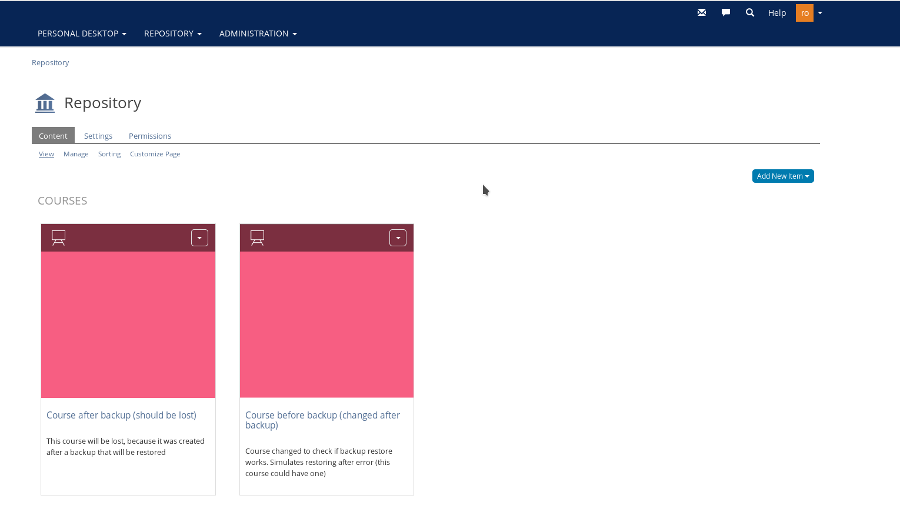
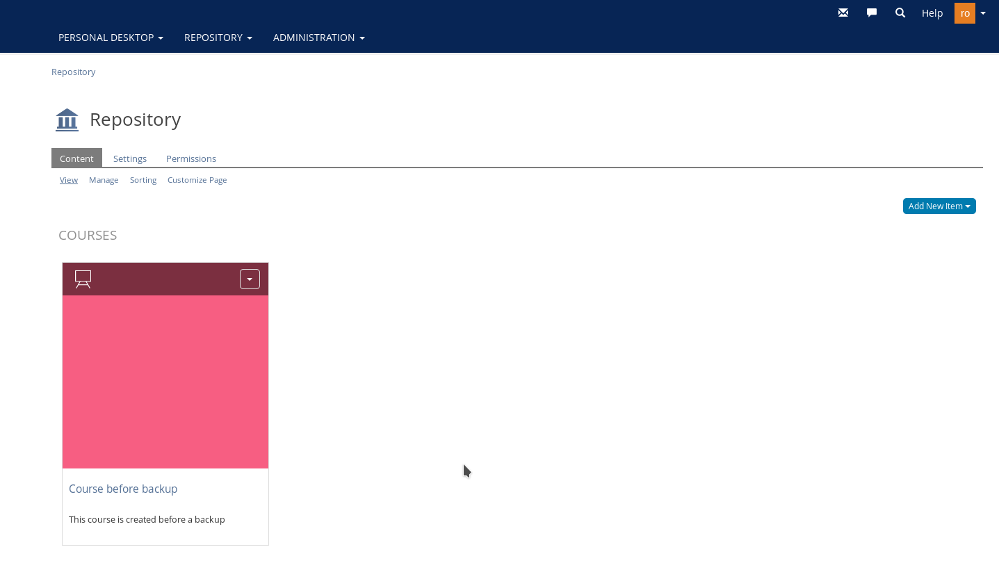

# Backup/Restore test protocol
# Description
Tests the backup/restore process by creating a backup, making some changes and restoring it afterwards.
# Expectation
The backup state should be restored (changes at backup time restored and changes after backup times lost)

## Steps to validate
- Purged everything
- Deleted backups and restore folders
- Installed on ilias-[1,2,3].example.org (school client was used during test)
- Fetched password from ilias-1.example.org using `docker-compose --env-file env_ilias-1.example.org logs`:
```
    ilias_1  | =======================================================
    ilias_1  | ILIAS installed successfully!
    ilias_1  | Log in using the following credentials:
    ilias_1  | 
    ilias_1  | User:           root
    ilias_1  | Password:       <pw>
    ilias_1  | Setup Password: <pw>
    ilias_1  | =======================================================
```
- Created course "Course before backup"
- Executed `bpctl backup`
- Changed course "Course before backup" to "Course before backup (changed after backup)"
- Created course "Course after backup (should be lost)"

- Called `bpctl restore`
    - Skipped nginx restore
- Restored ilias-1.example.org
- Skipped ilias[2,3].example.org
- Checked courses: Only course "Course before backup" exists (which is as expected)
